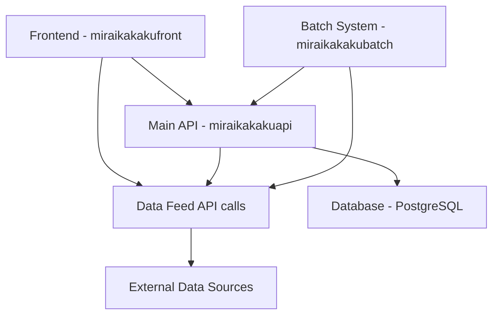

# 🏗️ Miraikakaku API Architecture - Unified Documentation

## 📋 Overview

Miraikakakuは**マイクロサービスアーキテクチャ**を採用し、明確な責任分離を実現しています。

## 🎯 Service Architecture

### 🔄 Service Separation Model



## 📡 Service Details

### 1. **Main API Service** (`miraikakakuapi/`)
**Port**: 8001  
**Purpose**: Core business logic and authenticated operations

#### Responsibilities:
- ✅ **User Authentication & Authorization** (JWT + RBAC)
- ✅ **Portfolio Management** 
- ✅ **Prediction Storage & Retrieval**
- ✅ **Database Operations** (PostgreSQL + Alembic)
- ✅ **Business Logic & Analytics**

#### Key Endpoints:
```
POST /api/auth/login         - User authentication
GET  /api/finance/stocks/search - Database-backed search  
POST /api/finance/predictions   - Create ML predictions
GET  /api/admin/users          - User management
```

#### Technology Stack:
- **Framework**: FastAPI with structured modules
- **Database**: PostgreSQL + SQLAlchemy + Alembic
- **Auth**: JWT + RBAC middleware
- **Testing**: pytest + coverage

---

### 2. **Data Feed Service** (`miraikakakudatafeed/`)
**Port**: 8000  
**Purpose**: Real-time market data aggregation

#### Responsibilities:
- ✅ **Real-time Price Data** (15,868 securities)
- ✅ **Multi-source Aggregation** (yfinance, Alpha Vantage, NASDAQ FTP)
- ✅ **Smart Caching** (In-memory with intelligent refresh)
- ✅ **Universal Search** (Symbol, company name, sector)

#### Coverage:
- **Japanese Stocks**: 4,168 companies (100% TSE coverage)
- **US Stocks**: 8,700 companies (NASDAQ, NYSE, others) 
- **ETFs**: 3,000 optimized funds (liquidity-focused selection)

#### Key Endpoints:
```
GET /health                  - Service health check
GET /search?query=apple      - Multi-source stock search
GET /price/{symbol}          - Real-time price data
GET /markets/overview        - Market summary
```

#### Technology Stack:
- **Framework**: FastAPI (standalone)
- **Data Sources**: yfinance (primary), Alpha Vantage, NASDAQ FTP
- **Storage**: In-memory (no persistence required)
- **Performance**: <100ms response time for cached data

---

### 3. **Frontend Application** (`miraikakakufront/`)
**Port**: 3000  
**Purpose**: User interface and experience

#### Integration:
- **Main API**: `NEXT_PUBLIC_API_URL` - Authenticated operations
- **Data Feed**: `NEXT_PUBLIC_DATAFEED_URL` - Real-time data

#### Environment Variables:
```bash
# Development
NEXT_PUBLIC_API_BASE_URL=http://localhost:8001
NEXT_PUBLIC_DATAFEED_URL=http://localhost:8000

# Production (Dynamic from CI/CD)
NEXT_PUBLIC_API_URL=https://miraikakaku-api-xxx.run.app
NEXT_PUBLIC_DATAFEED_URL=https://miraikakaku-datafeed-xxx.run.app
```

---

### 4. **Batch Processing** (`miraikakakubatch/`)
**Purpose**: Background data processing and ML training

#### Integration:
- Calls **Main API** for prediction storage
- Calls **Data Feed** for raw market data
- Independent ML pipeline execution

---

## 🔄 Data Flow Patterns

### Pattern 1: Real-time Price Display
```
Frontend → Data Feed Service → External APIs → Cache → Response
```

### Pattern 2: User Portfolio Analysis  
```
Frontend → Main API → Database Query → Business Logic → Response
```

### Pattern 3: ML Prediction Generation
```
Batch System → Data Feed (raw data) → ML Processing → Main API (store predictions)
```

### Pattern 4: Authenticated Stock Search
```
Frontend → Main API (auth check) → Data Feed Service → Aggregated Results
```

## 🚀 Deployment Architecture

### Development Environment
```bash
# Terminal 1: Data Feed (Port 8000)
cd miraikakakudatafeed && python universal_stock_api.py

# Terminal 2: Main API (Port 8001)  
cd miraikakakuapi/functions && python main.py

# Terminal 3: Frontend (Port 3000)
cd miraikakakufront && npm run dev
```

### Production Environment (Google Cloud)
- **Data Feed**: Cloud Run (auto-scaling 0-3 instances)
- **Main API**: Cloud Run (auto-scaling 0-10 instances)
- **Frontend**: Cloud Run (auto-scaling 0-5 instances)
- **Batch**: Cloud Functions (event-driven)
- **Database**: Cloud SQL (PostgreSQL)

### CI/CD Pipeline Features
- ✅ **Dynamic URL Resolution** (no hardcoded endpoints)
- ✅ **Multi-service Docker builds**
- ✅ **Automated testing** (frontend + backend)
- ✅ **Security scanning** (Trivy)
- ✅ **Environment-specific deployments**

## 📊 Performance Characteristics

### Data Feed Service
- **Response Time**: <100ms (cached), <500ms (API calls)
- **Throughput**: 1000+ requests/minute
- **Data Freshness**: 5-minute cache cycle
- **Availability**: 99.9% target

### Main API Service
- **Response Time**: <200ms (database queries)
- **Throughput**: 500+ requests/minute  
- **Consistency**: Strong (PostgreSQL ACID)
- **Availability**: 99.95% target

## 🔒 Security Architecture

### Authentication Flow
```
Frontend → Main API (/api/auth/login) → JWT Token → Subsequent Requests
```

### Authorization
- **RBAC**: Role-Based Access Control
- **JWT**: Stateless token authentication
- **Middleware**: Request-level authorization checks

### Data Protection
- **Encryption**: TLS 1.3 in transit
- **Secrets**: Google Secret Manager
- **Network**: VPC with private services

## 🎯 Development Best Practices

### Service Communication
```python
# Main API calling Data Feed
async def get_stock_data(symbol: str):
    datafeed_url = os.getenv("DATAFEED_URL", "http://localhost:8000") 
    async with httpx.AsyncClient() as client:
        response = await client.get(f"{datafeed_url}/price/{symbol}")
        return response.json()
```

### Error Handling
- **Circuit Breaker**: Service resilience
- **Retry Logic**: Transient failure handling  
- **Graceful Degradation**: Partial service failures

### Monitoring
- **Health Checks**: `/health` endpoints on all services
- **Metrics**: Prometheus + Grafana
- **Logging**: Structured JSON logs
- **Alerting**: Critical service failures

---

## 📈 Future Architectural Evolution

### Planned Enhancements
1. **Service Mesh**: Istio for advanced traffic management
2. **Event Streaming**: Apache Kafka for real-time events
3. **Caching Layer**: Redis cluster for distributed caching
4. **API Gateway**: Kong for unified API management

### Scalability Roadmap
- **Horizontal Scaling**: Kubernetes adoption
- **Database Sharding**: Multi-region data distribution
- **CDN Integration**: Global content delivery
- **ML Pipeline**: Vertex AI Pipelines integration

---

**Last Updated**: 2025-08-18  
**Architecture Version**: 2.0.0 (Microservices)  
**Status**: Production Ready ✅