# 🏛 Miraikakaku Project Architecture

Comprehensive architectural documentation for the Miraikakaku AI-driven stock prediction platform. This document outlines the system design, data flow, technology choices, and architectural patterns.

## 📋 Table of Contents

- [System Overview](#system-overview)
- [Architecture Patterns](#architecture-patterns)
- [Technology Stack](#technology-stack)
- [System Components](#system-components)
- [Data Architecture](#data-architecture)
- [API Design](#api-design)
- [Security Architecture](#security-architecture)
- [Deployment Architecture](#deployment-architecture)
- [Performance Considerations](#performance-considerations)

---

## 🎯 System Overview

Miraikakaku is a microservices-based platform that provides AI-powered stock market analysis and predictions. The system is designed for high availability, scalability, and real-time data processing.

### High-Level Architecture

```mermaid
graph TB
    Users[👥 Users] --> CDN[🌐 CDN/Load Balancer]
    CDN --> Frontend[🖥️ Next.js Frontend]
    Frontend --> API[🔗 FastAPI Backend]
    API --> DB[(🗄️ PostgreSQL)]
    API --> Cache[(⚡ Redis)]
    API --> Queue[📬 Message Queue]
    Queue --> Batch[🔄 Batch Processing]
    Batch --> ML[🤖 ML Models]
    External[📊 Market Data APIs] --> Batch
    
    subgraph Cloud Infrastructure
        Frontend
        API
        DB
        Cache
        Queue
        Batch
        ML
    end
```



### Key Architectural Principles

1. **Microservices Architecture**: Loosely coupled, independently deployable services
2. **Event-Driven Design**: Asynchronous communication via message queues
3. **Domain-Driven Design**: Business logic organized around domain contexts
4. **CQRS Pattern**: Separate read and write models for optimal performance
5. **Reactive Architecture**: Real-time updates via WebSocket connections
6. **Cloud-Native**: Containerized services deployed on cloud infrastructure

---

## 🏗 Architecture Patterns

### 1. Layered Architecture

```
┌─────────────────────────────────┐
│         Presentation Layer       │ ← React Components, Pages
├─────────────────────────────────┤
│         Application Layer        │ ← Hooks, Context, State Management
├─────────────────────────────────┤
│           Service Layer          │ ← Business Logic, API Clients
├─────────────────────────────────┤
│         Infrastructure Layer     │ ← HTTP, WebSocket, Storage
└─────────────────────────────────┘
```

### 2. Hexagonal Architecture (Ports & Adapters)

```
                  ┌─────────────────┐
         ┌────────│   Core Domain   │────────┐
         │        │   (Business     │        │
         │        │     Logic)      │        │
         │        └─────────────────┘        │
         │                                   │
    ┌────▼────┐                         ┌────▼────┐
    │  Web    │                         │Database │
    │Adapter  │                         │Adapter  │
    │(FastAPI)│                         │(SQLAlch)│
    └─────────┘                         └─────────┘
```

### 3. Event-Driven Architecture


---

## 🛠 Technology Stack

### Frontend Technology Stack

| Layer | Technology | Purpose | Version |
|-------|-----------|---------|---------|
| **Framework** | Next.js | React-based web framework | 15+ |
| **Language** | TypeScript | Type-safe JavaScript | 5+ |
| **Styling** | Tailwind CSS | Utility-first CSS framework | 3+ |
| **State Management** | React Context + Hooks | Client state management | - |
| **Charts** | Chart.js + Plotly.js | Data visualization | Latest |
| **Testing** | Jest + Testing Library | Unit and integration tests | Latest |
| **E2E Testing** | Playwright | End-to-end testing | Latest |
| **Build Tool** | Next.js Built-in | Webpack-based bundling | - |

### Backend Technology Stack

| Layer | Technology | Purpose | Version |
|-------|-----------|---------|---------|
| **Framework** | FastAPI | High-performance web framework | 0.100+ |
| **Language** | Python | Server-side programming | 3.9+ |
| **Database** | PostgreSQL | Primary data storage | 15+ |
| **Cache** | Redis | In-memory caching | 7+ |
| **ORM** | SQLAlchemy | Database abstraction | 2+ |
| **Message Queue** | Celery + Redis | Async task processing | Latest |
| **ML Framework** | TensorFlow + scikit-learn | AI/ML model training | Latest |
| **WebSocket** | FastAPI WebSockets | Real-time communication | - |

### Infrastructure Stack

| Component | Technology | Purpose |
|-----------|-----------|---------|
| **Containerization** | Docker + Docker Compose | Service containerization |
| **Orchestration** | Kubernetes / Cloud Run | Container orchestration |
| **Cloud Provider** | Google Cloud Platform | Cloud infrastructure |
| **CDN** | Google Cloud CDN | Content delivery |
| **Monitoring** | Google Cloud Monitoring | System observability |
| **CI/CD** | GitHub Actions | Continuous integration |
| **Load Balancer** | Google Cloud Load Balancer | Traffic distribution |

---

## 🔧 System Components

### Frontend Components

#### 1. Presentation Layer
```typescript
// Component hierarchy
App
├── Layout
│   ├── Header (Navigation, Search, User Menu)
│   ├── Sidebar (Main Navigation)
│   └── Footer (Links, Copyright)
├── Pages
│   ├── Home (Market Overview, Quick Actions)
│   ├── Dashboard (Real-time Data, Charts)
│   ├── Analysis (Detailed Stock Analysis)
│   ├── Rankings (AI Predictions, Performance)
│   └── Settings (User Preferences)
└── Common Components
    ├── Charts (Stock Charts, Predictions)
    ├── Forms (Search, Filters)
    └── UI Elements (Buttons, Cards, Modals)
```

#### 2. State Management
```typescript
// Context providers structure
<AppProvider>
  <AuthProvider>
    <ThemeProvider>
      <WebSocketProvider>
        <NotificationProvider>
          <App />
        </NotificationProvider>
      </WebSocketProvider>
    </ThemeProvider>
  </AuthProvider>
</AppProvider>
```

### Backend Components

#### 1. API Layer Structure
```python
# FastAPI application structure
app/
├── main.py                 # FastAPI app initialization
├── routers/
│   ├── auth.py            # Authentication endpoints
│   ├── stocks.py          # Stock data endpoints
│   ├── predictions.py     # AI prediction endpoints
│   └── websocket.py       # Real-time endpoints
├── services/
│   ├── auth_service.py    # Authentication logic
│   ├── stock_service.py   # Stock data processing
│   └── prediction_service.py  # AI prediction logic
├── models/
│   ├── database.py        # SQLAlchemy models
│   └── schemas.py         # Pydantic models
└── utils/
    ├── dependencies.py    # Dependency injection
    └── security.py        # Security utilities
```

#### 2. Domain Model

```python
# Core domain entities
class Stock:
    symbol: str
    company_name: str
    sector: str
    market_cap: float
    exchange: str

class StockPrice:
    symbol: str
    date: datetime
    open_price: float
    high_price: float
    low_price: float
    close_price: float
    volume: int

class Prediction:
    symbol: str
    predicted_price: float
    confidence_score: float
    model_type: str
    prediction_date: datetime
    target_date: datetime
```

---

## 📊 Data Architecture

### Data Flow Architecture


### Database Schema Design

#### Stock Master Table
```sql
CREATE TABLE stock_master (
    symbol VARCHAR(10) PRIMARY KEY,
    company_name VARCHAR(255) NOT NULL,
    exchange VARCHAR(50) NOT NULL,
    sector VARCHAR(100),
    industry VARCHAR(100),
    market_cap BIGINT,
    is_active BOOLEAN DEFAULT true,
    created_at TIMESTAMP DEFAULT CURRENT_TIMESTAMP,
    updated_at TIMESTAMP DEFAULT CURRENT_TIMESTAMP
);

CREATE INDEX idx_stock_name ON stock_master(company_name);
CREATE INDEX idx_stock_sector ON stock_master(sector);
```

#### Stock Price History Table
```sql
CREATE TABLE stock_price_history (
    id SERIAL PRIMARY KEY,
    symbol VARCHAR(10) REFERENCES stock_master(symbol),
    date DATE NOT NULL,
    open_price DECIMAL(10,4),
    high_price DECIMAL(10,4),
    low_price DECIMAL(10,4),
    close_price DECIMAL(10,4) NOT NULL,
    volume BIGINT,
    adjusted_close DECIMAL(10,4),
    data_source VARCHAR(50),
    created_at TIMESTAMP DEFAULT CURRENT_TIMESTAMP
);

CREATE UNIQUE INDEX idx_symbol_date ON stock_price_history(symbol, date);
CREATE INDEX idx_price_date ON stock_price_history(date);
```

#### Predictions Table
```sql
CREATE TABLE stock_predictions (
    id SERIAL PRIMARY KEY,
    symbol VARCHAR(10) REFERENCES stock_master(symbol),
    model_type VARCHAR(50) NOT NULL,
    prediction_date TIMESTAMP NOT NULL,
    target_date DATE NOT NULL,
    predicted_price DECIMAL(10,4) NOT NULL,
    confidence_score DECIMAL(5,4),
    prediction_horizon INTEGER,
    model_version VARCHAR(20),
    is_active BOOLEAN DEFAULT true,
    created_at TIMESTAMP DEFAULT CURRENT_TIMESTAMP
);

CREATE INDEX idx_predictions_symbol ON stock_predictions(symbol);
CREATE INDEX idx_predictions_date ON stock_predictions(prediction_date);
```

### Caching Strategy

#### Multi-Layer Caching
```python
# Redis caching layers
CACHE_LAYERS = {
    'L1': 'browser_cache',      # Browser cache (5 minutes)
    'L2': 'cdn_cache',          # CDN cache (15 minutes)
    'L3': 'app_cache',          # Application cache (1 hour)
    'L4': 'db_cache',           # Database query cache (6 hours)
}

# Cache key patterns
CACHE_KEYS = {
    'stock_price': 'price:{symbol}:{days}',
    'predictions': 'pred:{symbol}:{model}',
    'rankings': 'rank:{type}:{limit}',
    'search': 'search:{query}:{limit}'
}
```

---

## 🔌 API Design

### RESTful API Design Principles

1. **Resource-Based URLs**: `/api/stocks/{symbol}/predictions`
2. **HTTP Verbs**: GET, POST, PUT, DELETE for CRUD operations
3. **Consistent Response Format**: JSON with standard error codes
4. **Pagination**: Cursor-based pagination for large datasets
5. **Filtering**: Query parameters for filtering and sorting
6. **Versioning**: URL versioning (`/api/v1/`)

### API Response Standards

```json
{
  "data": {
    "symbol": "AAPL",
    "predictions": [...],
    "metadata": {
      "model_accuracy": 0.85,
      "last_updated": "2025-01-20T15:30:00Z"
    }
  },
  "pagination": {
    "current_page": 1,
    "total_pages": 5,
    "total_items": 50,
    "next_cursor": "eyJpZCI6MTIzfQ=="
  },
  "meta": {
    "request_id": "req_123456789",
    "timestamp": "2025-01-20T15:30:00Z",
    "api_version": "1.0.0"
  }
}
```

### WebSocket API Design

```typescript
// WebSocket message format
interface WebSocketMessage {
  type: 'price_update' | 'prediction_update' | 'system_alert';
  data: any;
  timestamp: string;
  correlation_id?: string;
}

// Client subscription format
interface SubscriptionRequest {
  action: 'subscribe' | 'unsubscribe';
  channel: string;
  filters?: Record<string, any>;
}
```

---

## 🔒 Security Architecture

### Authentication & Authorization

#### JWT Token-Based Authentication
```python
# Token structure
{
  "sub": "user_id",
  "email": "user@example.com",
  "role": "premium_user",
  "permissions": ["read:stocks", "write:watchlist"],
  "exp": 1642694400,
  "iat": 1642608000
}
```

#### Role-Based Access Control (RBAC)
```python
ROLES = {
    'basic_user': ['read:stocks', 'read:predictions'],
    'premium_user': ['read:stocks', 'read:predictions', 'write:watchlist', 'read:advanced_analytics'],
    'admin': ['*']  # All permissions
}
```

### Security Measures

1. **Input Validation**: Pydantic models for request validation
2. **SQL Injection Prevention**: SQLAlchemy ORM and parameterized queries
3. **XSS Protection**: Content Security Policy headers
4. **CSRF Protection**: SameSite cookies and CSRF tokens
5. **Rate Limiting**: API endpoint rate limiting
6. **HTTPS Encryption**: TLS 1.3 for all communications
7. **CORS Configuration**: Restricted origin policy

### Data Protection

```python
# Sensitive data encryption
from cryptography.fernet import Fernet

class DataEncryption:
    def __init__(self, key: str):
        self.cipher_suite = Fernet(key)
    
    def encrypt(self, data: str) -> str:
        return self.cipher_suite.encrypt(data.encode()).decode()
    
    def decrypt(self, encrypted_data: str) -> str:
        return self.cipher_suite.decrypt(encrypted_data.encode()).decode()
```

---

## 🚀 Deployment Architecture

### Cloud Infrastructure

#### Google Cloud Platform Architecture
```yaml
# Infrastructure components
Services:
  - Cloud Run (Frontend & API)
  - Cloud SQL (PostgreSQL)
  - Cloud Memorystore (Redis)
  - Cloud Storage (Static assets)
  - Cloud CDN (Content delivery)
  - Cloud Load Balancer (Traffic distribution)
  - Cloud Build (CI/CD)
  - Cloud Monitoring (Observability)
```

#### Kubernetes Deployment
```yaml
# k8s-deployment.yaml
apiVersion: apps/v1
kind: Deployment
metadata:
  name: miraikakaku-api
spec:
  replicas: 3
  selector:
    matchLabels:
      app: miraikakaku-api
  template:
    metadata:
      labels:
        app: miraikakaku-api
    spec:
      containers:
      - name: api
        image: gcr.io/miraikakaku/api:latest
        ports:
        - containerPort: 8000
        env:
        - name: DATABASE_URL
          valueFrom:
            secretKeyRef:
              name: db-secret
              key: url
        resources:
          requests:
            memory: "256Mi"
            cpu: "250m"
          limits:
            memory: "512Mi"
            cpu: "500m"
```

### Scaling Strategy

#### Horizontal Scaling
- Frontend: Multiple Next.js instances behind load balancer
- API: Auto-scaling based on CPU/memory usage
- Database: Read replicas for read-heavy workloads
- Cache: Redis cluster for high availability

#### Vertical Scaling
- Machine learning services with GPU acceleration
- Database instances with high-performance SSDs
- Memory-optimized instances for caching layer

---

## ⚡ Performance Considerations

### Frontend Performance

#### Optimization Techniques
1. **Code Splitting**: Route-based and component-based splitting
2. **Image Optimization**: Next.js Image component with WebP format
3. **Caching Strategy**: Service Worker for offline functionality
4. **Bundle Optimization**: Tree shaking and dead code elimination
5. **Lazy Loading**: Components and images loaded on demand

```typescript
// Performance monitoring
const performanceObserver = new PerformanceObserver((list) => {
  for (const entry of list.getEntries()) {
    if (entry.entryType === 'largest-contentful-paint') {
      console.log('LCP:', entry.startTime);
    }
  }
});

performanceObserver.observe({ entryTypes: ['largest-contentful-paint'] });
```

### Backend Performance

#### Database Optimization
```python
# Query optimization with indexes
class OptimizedQueries:
    @staticmethod
    def get_stock_prices_with_predictions(symbol: str, days: int):
        return db.query(StockPrice, Prediction).join(
            Prediction, 
            and_(
                StockPrice.symbol == Prediction.symbol,
                StockPrice.date == Prediction.target_date
            )
        ).filter(
            StockPrice.symbol == symbol,
            StockPrice.date >= datetime.now() - timedelta(days=days)
        ).options(
            selectinload(StockPrice.predictions)
        ).all()
```

#### Caching Implementation
```python
# Redis-based caching decorator
def cache_result(expiry: int = 3600):
    def decorator(func):
        @wraps(func)
        async def wrapper(*args, **kwargs):
            cache_key = f"{func.__name__}:{hash(str(args) + str(kwargs))}"
            cached_result = await redis_client.get(cache_key)
            
            if cached_result:
                return json.loads(cached_result)
            
            result = await func(*args, **kwargs)
            await redis_client.setex(
                cache_key, 
                expiry, 
                json.dumps(result, default=str)
            )
            return result
        return wrapper
    return decorator
```

### Machine Learning Performance

#### Model Optimization
```python
# TensorFlow Lite for production inference
import tensorflow as tf

class OptimizedMLModel:
    def __init__(self, model_path: str):
        self.interpreter = tf.lite.Interpreter(model_path=model_path)
        self.interpreter.allocate_tensors()
        
    def predict(self, input_data):
        input_details = self.interpreter.get_input_details()
        output_details = self.interpreter.get_output_details()
        
        self.interpreter.set_tensor(input_details[0]['index'], input_data)
        self.interpreter.invoke()
        
        return self.interpreter.get_tensor(output_details[0]['index'])
```

---

## 📊 Monitoring & Observability

### Application Monitoring

#### Metrics Collection
```python
# Custom metrics with Prometheus
from prometheus_client import Counter, Histogram, Gauge

API_REQUESTS = Counter('api_requests_total', 'Total API requests', ['method', 'endpoint'])
REQUEST_DURATION = Histogram('api_request_duration_seconds', 'Request duration')
ACTIVE_PREDICTIONS = Gauge('active_predictions_count', 'Number of active predictions')

@REQUEST_DURATION.time()
def timed_api_call():
    # API logic here
    pass
```

#### Logging Strategy
```python
import structlog

logger = structlog.get_logger()

# Structured logging
logger.info(
    "Stock prediction generated",
    symbol="AAPL",
    model_type="lstm",
    confidence=0.85,
    prediction_id="pred_123",
    user_id="user_456"
)
```

### Error Tracking

```python
# Error monitoring with Sentry
import sentry_sdk
from sentry_sdk.integrations.fastapi import FastApiIntegration

sentry_sdk.init(
    dsn="YOUR_SENTRY_DSN",
    integrations=[FastApiIntegration()],
    traces_sample_rate=0.1,
    environment="production"
)
```

---

## 🔮 Future Architecture Considerations

### Planned Enhancements

1. **Microservices Migration**: Break monolith into smaller services
2. **Event Sourcing**: Implement event sourcing for audit trails
3. **GraphQL API**: Add GraphQL layer for flexible data queries
4. **Machine Learning Pipeline**: MLOps with automated model training
5. **Multi-Region Deployment**: Global deployment for better latency
6. **Blockchain Integration**: Decentralized data verification

### Scalability Roadmap

#### Phase 1: Current Architecture (0-10K users)
- Monolithic deployment
- Single database instance
- Basic caching

#### Phase 2: Microservices (10K-100K users)
- Service decomposition
- Database per service
- Event-driven communication

#### Phase 3: Global Scale (100K+ users)
- Multi-region deployment
- Advanced caching strategies
- CDN optimization

---

## 📚 References & Standards

### Architectural Standards
- [12-Factor App Methodology](https://12factor.net/)
- [Microservices Patterns](https://microservices.io/patterns/)
- [Clean Architecture](https://blog.cleancoder.com/uncle-bob/2012/08/13/the-clean-architecture.html)
- [Domain-Driven Design](https://domainlanguage.com/ddd/)

### Technology Documentation
- [Next.js Architecture Guide](https://nextjs.org/docs/architecture)
- [FastAPI Documentation](https://fastapi.tiangolo.com/)
- [PostgreSQL Best Practices](https://www.postgresql.org/docs/current/performance-tips.html)
- [Google Cloud Architecture Center](https://cloud.google.com/architecture)

### Security Standards
- [OWASP Top 10](https://owasp.org/www-project-top-ten/)
- [NIST Cybersecurity Framework](https://www.nist.gov/cyberframework)
- [OAuth 2.0 Security Best Practices](https://datatracker.ietf.org/doc/html/draft-ietf-oauth-security-topics)

---

**Last Updated**: January 2025 | **Architecture Version**: 1.0.0

*This architecture documentation is a living document that evolves with the system. Please contribute updates and improvements as the system grows.*